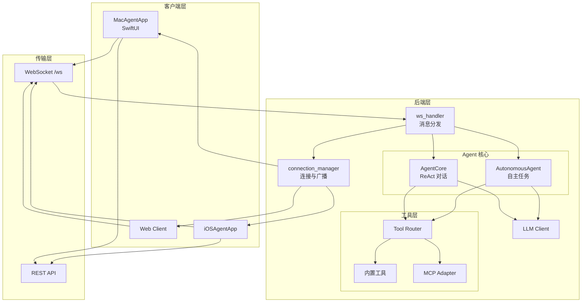
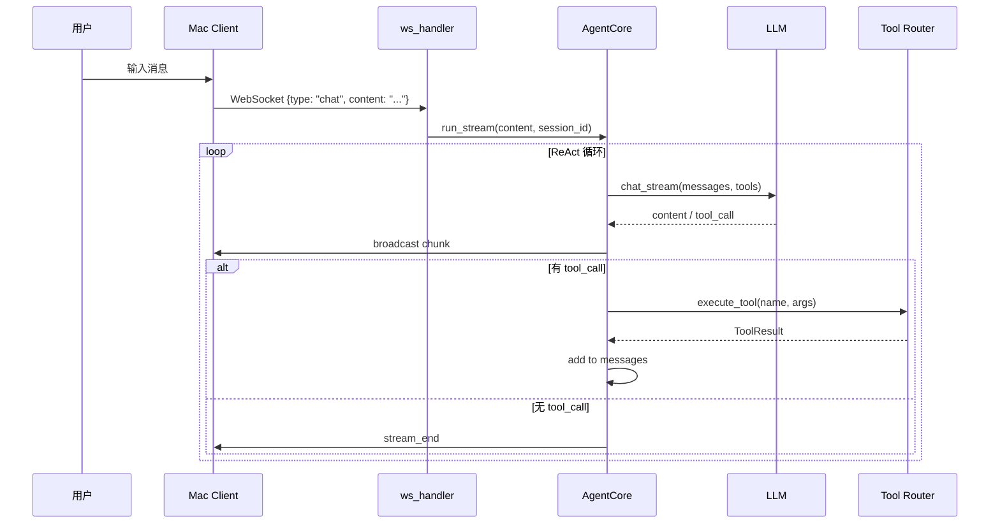
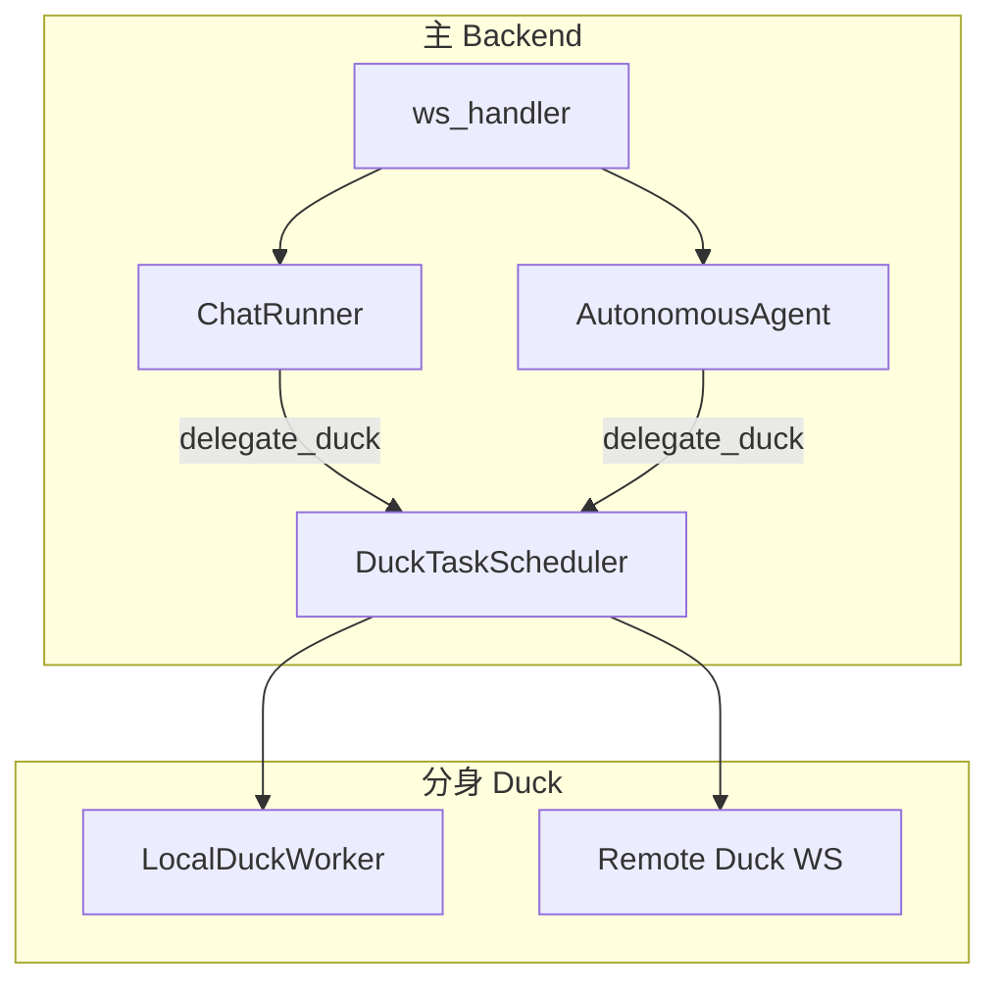

# MacAgent 技术文档

MacAgent（Chow Duck）是 macOS 系统级智能助手，可代表用户执行终端、文件、截图、邮件等操作。本文档从**功能**、**底层实现**、**Agent 路线**、**框架**、**架构**五个维度说明项目。

### 文档导航

| 维度 | 章节 | 内容概要 |
|------|------|----------|
| **功能** | 一 | 核心能力、项目结构、技术栈 |
| **底层** | 二 | 核心组件、配置持久化、启动流程 |
| **Agent 路线** | 三 | 消息分发、Chat/Autonomous/Duck 执行链路 |
| **框架** | 四 | v3 框架层、领域路由、统一工具路由 |
| **架构** | 五 | 整体架构图、数据流、主 Agent 与 Duck |

---

## 一、功能（Features）

### 1.1 核心能力

| 能力 | 说明 |
|------|------|
| **流式对话（Chat）** | ReAct 循环，支持工具调用（terminal、file、app、screenshot、capsule 等） |
| **自主任务（Autonomous）** | 三阶段（Gather → Act → Verify）自主执行，无需用户逐步确认 |
| **Duck 委派** | 主 Agent 可将子任务委派给本地/远程 Duck 分身并行执行 |
| **Capsule 技能** | 本地技能 + EvoMap 进化网络，支持 find→execute 流程 |
| **MCP 扩展** | 集成 GitHub、Brave Search、Puppeteer、Filesystem 等 MCP 服务 |
| **Workspace 上下文** | 当前工作目录、打开文件列表注入，接近 Cursor 的文件关联 |
| **终端会话** | 同一 session 内复用 cwd、环境变量，支持「上一条输出」作为下一条输入 |
| **自愈与升级** | EventBus 解耦：错误分类、反思、Self-Upgrade 沙箱、工具自动升级 |
| **HITL 与回滚** | 危险操作弹窗确认，文件操作前快照支持 write/delete/move/copy 一键 undo |
| **可观测** | Trace 全链路、Token 统计、深度健康检查、benchmark 自动化 |

### 1.2 项目顶层结构

```
MacAgent/
├── MacAgentApp/          # macOS SwiftUI 客户端
├── iOSAgentApp/          # iOS 客户端（可选）
├── web/                  # Web 客户端（React/Vite）
├── website/              # Web 官网/仪表板
├── backend/              # Python FastAPI 后端
└── docs/                 # 设计文档
```

### 1.3 技术栈

| 层级 | 技术 |
|------|------|
| Mac 客户端 | SwiftUI、Combine、WebSocket |
| 后端 | Python 3.10+、FastAPI、uvicorn、WebSocket |
| LLM | DeepSeek / OpenAI / Ollama / LM Studio |
| 工具扩展 | MCP（Model Context Protocol）、Capsule 技能 |

---

## 二、底层实现（Underlying）

### 2.1 核心组件

| 组件 | 位置 | 职责 |
|------|------|------|
| **AgentCore** | `agent/core.py` | ReAct 循环：构建消息 → 调用 LLM → 解析 tool_calls → 执行 → 追加结果 |
| **AutonomousAgent** | `agent/autonomous_agent.py` | 三阶段主循环，动作类型：run_shell、read_file、write_file、call_tool、delegate_duck、finish |
| **ChatRunner** | `agent/chat_runner.py` | 封装 AgentCore.run_stream，供 ws_handler 调用 |
| **ContextManager** | `agent/context_manager.py` | recent_messages、vector_store（BGE）、created_files、max_context_tokens |
| **Tool Router** | `tools/router.py` | 内置工具优先 → MCP fallback，统一 execute_tool |
| **LLMClient** | `agent/llm_client.py` | 远程 function calling / 本地 LocalToolParser 解析 |

### 2.2 配置与持久化

- **LLM 配置**：`config/llm_config.py` → `data/llm_config.json`
- **MCP 配置**：`data/mcp_servers.json`
- **Duck 注册**：`data/duck_registry.json`
- **Capsule 源**：`config/capsule_sources.json`、`capsules_cache/`

### 2.3 启动流程（main.py lifespan）

1. 加载 LLM 配置，创建主/云端/本地/反思 LLM 客户端
2. 初始化 AgentCore、AutonomousAgent
3. 注册 Terminal、Self-Upgrade、Capsule、EvoMap、EventBus 等钩子
4. 预加载 BGE 向量模型
5. 加载 MCP 配置并 sync 到 ToolRegistry
6. Duck 模式：注册权限过滤、启动 Duck WebSocket 客户端

---

## 三、Agent 路线（Agent Flow）

### 3.1 消息入口与分发

所有用户请求通过 **WebSocket `/ws`** 进入 `ws_handler.py`，按 `message.type` 分发：

| 消息类型 | Handler | 说明 |
|----------|---------|------|
| `chat` | `_handle_chat` | 流式对话 → ChatRunner.run_stream() |
| `autonomous_task` | `_handle_autonomous_task` | 自主任务 → AutonomousAgent.run_autonomous() |
| `chat_to_duck` | `_handle_chat_to_duck` | 直聊 Duck，主 Agent 执行后广播 duck_task_complete |
| `stop` | 取消当前 session 的 Chat/Autonomous 任务 |
| `new_session` / `clear_session` | 会话管理 |
| `resume_chat` / `resume_task` | 断线恢复 |
| `get_episodes` / `get_statistics` | 记忆查询 |
| `get_system_messages` | 系统通知 |
| `get_model_stats` / `analyze_task` | 模型统计 |

### 3.2 Chat 路线（ReAct）

```
用户 → WS "chat" → _handle_chat
  → ChatRunner.run_stream(prompt, session_id)
  → AgentCore.run_stream()
    → context_manager.get_context_messages()
    → get_relevant_schemas(query) 裁剪工具
    → llm.chat_stream(messages, tools)
    → 解析 content / tool_call
    → execute_tool(name, args) → 广播 chunk
    → 若 tool_call 为 delegate_duck → DuckTaskScheduler.submit()
  → 循环 until stream_end
```

### 3.3 Autonomous 路线（三阶段）

```
用户 → WS "autonomous_task" → _handle_autonomous_task
  → AutonomousAgent.run_autonomous(goal, session_id)
  → 循环：Gather → Act → Verify
    → 模型选择：model_selector 按复杂度选 Fast/Strong/Cheap
    → 动作解析：run_shell、read_file、write_file、call_tool、delegate_duck、finish
    → 若 delegate_duck → DuckTaskScheduler.submit()
    → 可选 reflect_llm 分析失败
  → 完成 / 超时 / 用户 stop
```

### 3.4 Duck 委派路线

```
主 Agent 输出 delegate_duck
  → DuckTaskScheduler.submit(description, strategy, target_duck_id)
  → DuckRegistry.list_available() 选 Duck
  → 本地：LocalDuckWorker.enqueue_task() → AutonomousAgent.run()
  → 远程：duck_ws.send_to_duck(TASK) → Duck 执行 → RESULT 回传
  → duck_task_complete 广播到源 session
```

---

## 四、框架（Framework）

### 4.1 v3 框架层（backend/core/）

| 模块 | 职责 |
|------|------|
| `error_model` | AgentError、ErrorCategory、to_agent_error |
| `task_state_machine` | TaskState、TaskStateMachine |
| `concurrency_limiter` | Autonomous/LLM 并发限流 |
| `timeout_policy` | 统一超时配置 |

### 4.2 领域路由（backend/routes/）

| 领域 | 路由 | 说明 |
|------|------|------|
| 健康 | `/health`, `/health/deep` | 基础/深度健康检查 |
| 配置 | `/config`, `/config/smtp`, `/config/github` | LLM/邮件/GitHub |
| 工具 | `/tools`, `/tools/pending`, `/tools/approve` | 工具管理 |
| 对话 | `/chat` | 非流式对话 |
| 记忆 | `/memory/*`, `/model-selector/*` | 记忆与模型选择 |
| 自愈 | `/self-healing/*` | 自愈诊断与执行 |
| 监控 | `/monitor/*`, `/usage-stats/*` | 执行历史、Token 统计 |
| 追踪 | `/traces` | Trace 查询 |
| MCP | `/mcp/servers`, `/mcp/tools` | MCP 管理 |
| 隧道 | `/tunnel/*` | Cloudflared |
| 权限 | `/permissions/*` | 权限状态 |
| Duck | `/duck/*`, `/ws/duck` | Duck 注册与任务 |
| 审计 | `/audit` | 审计日志 |
| HITL | `/hitl/*` | 人工审批 |
| 会话 | `/sessions/*` | 会话恢复/Fork |
| 工作区 | `/workspace` | 上报 cwd、open_files |
| 回滚 | `/rollback/*` | 快照回滚 |
| 录制 | `/recordings/*` | 操作录制 |
| 文件索引 | `/file-index/*` | 工作区文件索引 |

### 4.3 统一工具路由

```
Agent → Tool Router → Builtin Tools → MCP Adapter（fallback）
```

- **内置工具优先**：file_tool、terminal_tool、app_tool、screenshot_tool 等
- **MCP Fallback**：内置执行失败时自动尝试同名 MCP 工具
- **MCP 独有工具**：以 `{server}_{tool}` 格式暴露给 LLM
- **重名遮蔽**：MCP 与内置重名的注册为 `mcp/` 前缀（隐藏），LLM 无感知

---

## 五、架构（Architecture）

### 5.1 整体架构



### 5.2 数据流



### 5.3 主 Agent 与 Duck 架构



---

## 六、项目结构

### 6.1 后端结构

```
backend/
├── main.py                 # 入口：lifespan、FastAPI、路由注册
├── app_state.py            # 全局状态（LLM/agent 单例、TaskTracker、FeatureFlags）
├── auth.py                 # 认证
├── connection_manager.py   # WebSocket 连接与 session 广播
├── ws_handler.py           # WebSocket /ws 消息分发
├── config/                 # 配置持久化（llm/agent/smtp/github）
├── core/                   # v3 框架层（错误模型、状态机、限流、超时）
├── agent/                  # Agent 能力
│   ├── core.py             # AgentCore ReAct 循环
│   ├── autonomous_agent.py # 自主任务、三阶段执行
│   ├── llm_client.py       # 统一 LLM 客户端
│   ├── context_manager.py  # 对话上下文、向量检索
│   ├── model_selector.py   # 三级模型路由
│   ├── mcp_client.py       # MCP 连接器
│   └── ...
├── routes/                 # HTTP 路由（按领域拆分）
├── tools/                  # 工具实现
├── runtime/                # 平台适配（mac/win/linux）
├── llm/                    # LLM 解析/修复
└── data/                   # 运行时数据
```

### 6.2 Mac 客户端结构

```
MacAgentApp/
├── MacAgentApp.swift
├── ContentView.swift
├── ViewModels/
│   ├── AgentViewModel.swift      # 主视图模型
│   └── MonitoringViewModel.swift
├── Services/
│   ├── BackendService.swift      # WebSocket
│   ├── ProcessManager.swift      # 后端启停
│   ├── PermissionManager.swift
│   └── ...
├── Views/
│   ├── 聊天/                     # ChatView、InputBar、MessageBubble
│   ├── Monitoring/               # 监控仪表板
│   ├── SettingsView, MCPSettingsView
│   └── ...
└── Models/
    └── Message.swift
```

---

## 七、技术设计要点

### 7.1 对话模式（ReAct）

**AgentCore** 实现 ReAct 循环：

1. **上下文构建**：`context_manager.get_context_messages()`，含 BGE 向量检索、会话历史
2. **Query 分类**：`QueryTier`（simple/complex）→ `max_tokens`、`system_prompt`
3. **工具裁剪**：`get_relevant_schemas(query)` 按语义/关键词选最多 8 个工具 schema
4. **流式调用**：`llm.chat_stream(messages, tools)` → `content` / `tool_call` / `finish`
5. **工具执行**：`execute_tool(name, args)` → builtin 优先，MCP fallback
6. **循环**：追加 tool_result 到 messages，继续下一轮 LLM 调用

### 7.2 自主任务模式（Autonomous）

**AutonomousAgent** 三阶段主循环：

| 阶段 | 说明 |
|------|------|
| **Gather** | 收集信息、分析任务 |
| **Act** | 执行动作（run_shell、read_file、write_file、call_tool、delegate_duck 等）|
| **Verify** | 自动验证执行结果，注入 LLM 上下文 |

- **动作类型**：`run_shell`、`read_file`、`write_file`、`create_and_run_script`、`call_tool`、`delegate_duck`、`finish`
- **模型选择**：`model_selector` 按任务复杂度选 Fast/Strong/Cheap
- **反思**：可选 `reflect_llm` 分析失败原因
- **Escalation**：`ESCALATION_FORCE_SWITCH`、`ESCALATION_SKILL_FALLBACK`

### 7.3 上下文与记忆

- **ContextManager**：`recent_messages`、`vector_store`（BGE）、`created_files`、`max_context_tokens`
- **QueryTier**：`simple`(8k)、`complex`(32k)、`json_probe`(60k)、`long_doc`(80k)
- **EpisodicMemory**：情景记忆，v3.2 支持重要性加权
- **MACAGENT.md**：项目级持久说明，注入 system prompt

### 7.4 LLM 客户端

- **远程模型**：function calling（OpenAI 兼容 API）
- **本地模型**：`LocalToolParser` 解析文本输出为 tool_calls
- **配置**：`config/llm_config.py` 持久化到 `data/llm_config.json`
- **三级路由**：Fast（本地/低延迟）、Strong（旗舰远程）、Cheap（性价比）

### 7.5 MCP 集成

- **传输**：stdio（npx 子进程）、HTTP（SSE）
- **配置**：`data/mcp_servers.json`
- **同步**：`sync_mcp_tools_to_registry(registry, mcp_manager)` 启动时执行
- **内置服务**：GitHub、Brave Search、Sequential Thinking、Puppeteer、Filesystem、Memory

### 7.6 Duck 委派

- **显式委派**：LLM 输出 `delegate_duck` 时由 `DuckTaskScheduler.submit()` 调度
- **DuckRegistry**：维护 Duck 注册、心跳、`current_task_id`
- **LocalDuckWorker**：本机队列，用主 Backend 的 `get_autonomous_agent()` 执行
- **远程 Duck**：WebSocket 连主 Backend，收 TASK、回传 RESULT

### 7.7 安全与可控

- **危险命令校验**：`safety.py` 拒绝 `rm -rf /` 等
- **Self-Upgrade 沙箱**：`resource_dispatcher`（cwd 限制、命令黑名单、超时）
- **HITL**：危险操作弹窗确认，可配超时
- **审计**：`data/audit/` 全量操作记录
- **快照回滚**：文件操作前自动快照，支持 write/delete/move/copy 一键 undo

### 7.8 可观测

- **Trace**：span 级 token 统计、工具调用记录
- **Traces API**：`GET /traces`、`GET /traces/{task_id}`、`GET /traces/{task_id}/spans`
- **深度健康**：`GET /health/deep` 检查 8 子系统
- **Benchmark**：`scripts/run_benchmark.py` B1-B7 用例

---

## 八、主线文档索引

| 文档 | 用途 |
|------|------|
| [backend-structure.md](backend-structure.md) | 后端目录与模块说明 |
| [主线目标与路线图.md](主线目标与路线图.md) | 2026 标杆、Claude Code 对齐、Phase A/B/C |
| [痛点分析与解决方案.md](痛点分析与解决方案.md) | 当前痛点与 P0/P1/P2 方案 |
| [AGENT_DUCK_TASK_ARCHITECTURE.md](AGENT_DUCK_TASK_ARCHITECTURE.md) | 主 Agent 与 Duck 任务架构 |
| [API-Endpoints.md](API-Endpoints.md) | REST API 完整端点参考 |
| [Mac-App-UI-Guide.md](Mac-App-UI-Guide.md) | Mac App 设置页说明 |
| [测试与验收.md](测试与验收.md) | 测试、自愈、benchmark 验收入口 |

**归档**：历史与专项文档见 [archive/](archive/)。

---

## 九、相关

- Agent 项目上下文（供注入）：`backend/data/prompts/MACAGENT.md`
